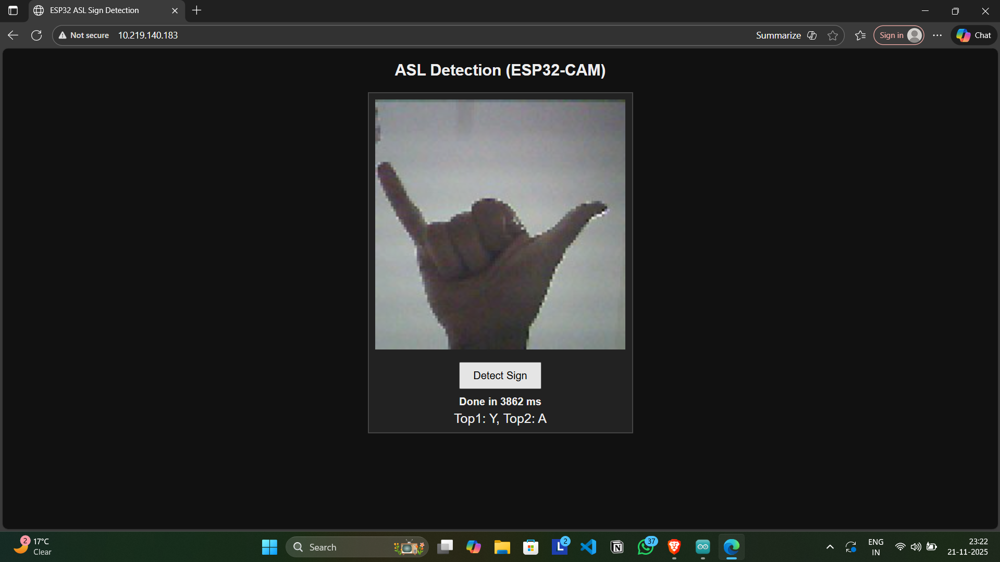

# ASL Detection using ESP32-CAM and TinyML

Real-time American Sign Language (ASL) recognition system using ESP32-CAM and TensorFlow Lite for Microcontrollers (TinyML).

---

## Features

- Real-time ASL gesture recognition
- TinyML deployment on ESP32-CAM
- Quantized TensorFlow Lite Micro model
- Embedded web interface
- On-device inference without cloud dependency
- Lightweight and low-power implementation

---

## Hardware Used

- ESP32-CAM
- OV2640 Camera Module
- USB-to-Serial Programmer

---

## Software Stack

- Arduino IDE
- TensorFlow Lite Micro
- OpenCV
- Python
- TinyML

---

## System Workflow

1. Capture image using ESP32-CAM
2. Preprocess and downsample image
3. Run TensorFlow Lite Micro inference
4. Predict ASL gesture
5. Display result through web interface

---

## Demo Video

[Watch Demo Video](https://youtu.be/qx_xmj70Hi8)

---

## Screenshots

### Web Interface

### Hardware Setup

---

## Performance

| Parameter | Value |
|---|---|
| Accuracy | ~87–90% |
| Inference Time | ~45–60 ms |
| FPS | ~5 FPS |

---

## Applications

- Assistive communication systems
- Embedded AI
- TinyML applications
- Edge-based gesture recognition

---

## Future Improvements

- Dynamic gesture support
- Mobile app integration
- Audio output support
- Improved CNN architectures

---

## Author

Khushwant Arya

GitHub: https://github.com/0xKhushwant
